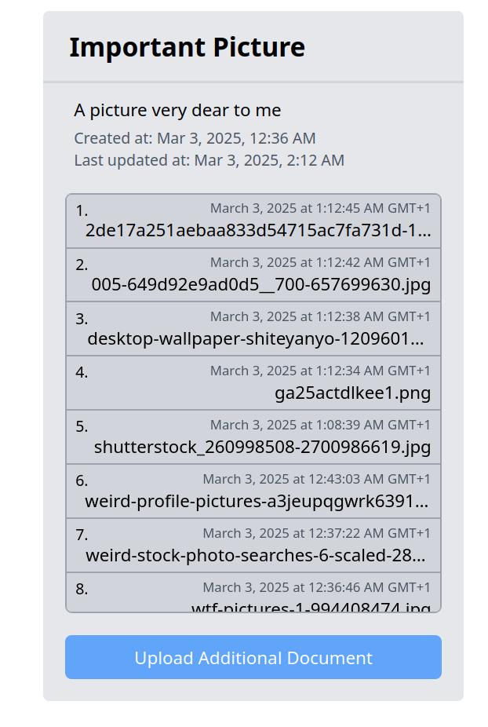

# Getting it to run

## Prerequisites

- Docker
- pnpm
- Make (but not required if you just manually run the commands)

## Setting up

Install dependencies:

```bash
pnpm i
```

Starting the database:

```bash
make up
```

Running backend:

```bash
pnpm nx serve backend
```

Running frontend:

```bash
pnpm nx dev frontend
```

There's also a few tests for BE if you want to run them:

```bash
pnpm nx run backend:test
```

##

Possible issue when running frontend / backend / tests:

```bash
 NX   Failed to process project graph.

An error occurred while processing files for the @nx/eslint/plugin plugin (Defined at nx.json#plugins[1])
.
  - eslint.config.mjs: Key "rules": Key "import/no-unresolved": Could not find plugin "import" in configuration.

```

If you encounter this, run the following command before trying the failing command again:

```bash
pnpm nx reset
```

## Forewarning

I had a lot of issues with NX / Bundlers / Compilers / etc.
The `Failed to process project graph.` is one of these issues which I just decided to never even bother figuring out how to fix.
There were many others which were much more problematic.
I spent the majority of my time just trying to get things to run, and not actually developing anything.
It was like I was walking around the house and stubbing my toe on every corner.
You might spot some dead configs or the entire contracts project (under the wrong apps project directory, but ignore that), which I just couldn't get to work.
As a result, a lot of the code is what it is.

What does this mean?

- Barebone BE, but not as much as FE
- Pretty much no tests for BE
- Barebone FE (no tests of course) - only file uploading and listing is implemented
- Edge cases are barely covered
- Barely any API parameter validation (it is setup though, endpoints just need to be decorated with the appropriate decorators)
- A mess of a codebase, all things considered
- No docker builds
- What even is DRY? (certainly doesn't exist in this codebase)

Hopefully, it's not as bad as I think it is.

There's a few more additional notes at the end discussing some design decisions and improvements that could be made.

## How to use

There is a database dump present under migrations which should run on database startup, so once you have everything up and running, you can navigate to the following [URL](http://localhost:3000/virtualDocument/01955938-2297-736a-8245-940a375eca9c) to play around a bit with the virtual document.
It should look like this:



Clicking on any of the listed files will download it.
Clicking on the upload additional document will open a file picker to upload a file.
There's a file size limit of ~1MB, but there's a chance it might still fail regardless (there's some issue with how the buffer gets handled / escaped when storing to the DB).
Sadly, this is all I got done for FE. But hopefully, this single one should be enough to show that folder navigation wouldn't be that far off.

---

You can also play around with the BE API directly on the [URL](http://localhost:3001/docs).

## Design Decisions

One thing that might immediately make you go hmmmm is the database schema.
The next thing would probably be the storage of files in the DB.

### Database Schema


My guess is that the most common approach developers would take here would be to have a 1:N relationship between all these tables (VirtualFolder, VirtualDocument, StoredDocument).

This would result in a way more simpler schema, and interactions in the codebase as well.
The reason I went with a N:N relationship was because I wanted to leave the door open for more flexibility, like a single file being shared across multiple virtual documents.
It's entirely possible these concerns are unwarranted or maybe even detremental to the overall design, but that's how I went with it.

Also, it's highly likely that users would want to be able to put folders into other folders, or see virtual documents on their own at the top level without them being in their own folder.
Some approaches that could be taken would be virtual folders referencing themselves (probably really bad idea), or storing "paths" in the folders themselves, and resolving them on the application level.
Files being present at the top level could be solved quite simply, by just having a top level folder that's hidden from users.

### File Storage

Now, I went with storing the files in the DB for the sake of auditability.
While they certainly could have been stored on the file system or any other storage solution, this is how I went at it (my guess is that if the government is your client, you'd need to be auditable).
But yeah, the most common approach here would have been to just store them outside the database on the filesystem when developing locally, or storing it to some online storage solution like AWS S3.

### Input parameter validation

There's barely any validation of input parameters.
There are some basic checks here and there, such as making sure that a file is being uploaded to a Virtual Document that actually exists.
But for the most part, the input parameters are not validated.
Relating to this, there could be better file checks outside of just the file size one.
Specifically, mime checking could be added while the file is still being uploaded, immediatelly aborting if the file being uploaded is not something we can accept... though, given this is just a regular file sharing service, it might not even be that relevant.

### (Ab)usage of Typescript Namespaces

This is how I personally like to structure my code.
I wrap logically related classes / types / functions under a single namespace.
This allows me to express multiple concerns under a common namespace, without poluting the entier codebase with types and classes that are only really relevant inside a particular module.
It's still being poluted, just not as much.

### Controller / Action / Provider

This is another personal preference, thought I'm still iterating a bit on it.
I have a generic provider of some external I/O, which I then wrap in a module scoped provider (see StoredDocumentProvider.ts).
This allows me to add a layer of abstraction between the DB and code that uses it, which comes in handy when writing tests (since you can just provide your own instance of the provider that does things differently, without having to rely on mocking everything in existence).
Next are actions, which are essentially just be small units of work that can be done.
These are also what are exposed outside the module. Though, I'm beginning to think this approach might need some more iterating.
Finally, controllers make use of these actions and use their outputs to fulfull the endpoint contract.
All these layers between the internals and the endpoint implementation allow for easier development without having to worry that the slightest change might break everything.

### DB transactions and fault tolerance

Currently, BE does not use any transactions.
I did not bother adding. But this means that any issue in the middle of a business process can leave the database in a partial state, like a Virtual Document without any Stored Document.
A transaction would ensure that the entire process is executed atomically, or not at all.
Of course, this only works when all the operations are executed within the same service.
More distributed systems would require a different approach.

### Pagination

I did not implement any pagination.
I did, however, implement some things that would allow for it.
For example, IDs are generated using UUID v7, which allows for sorting of the UUIDs and being able to implement stable pagination using cursors.
